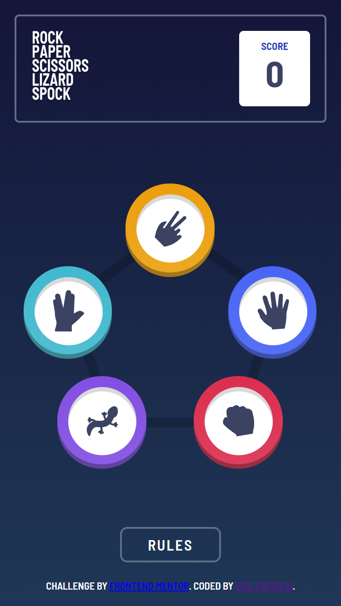
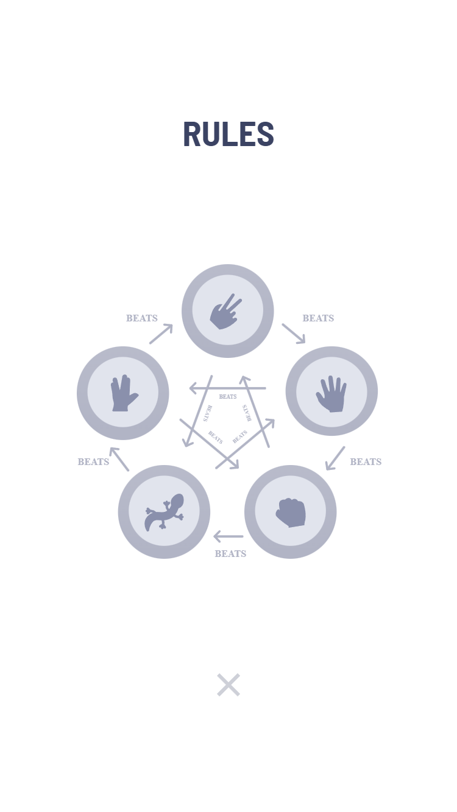
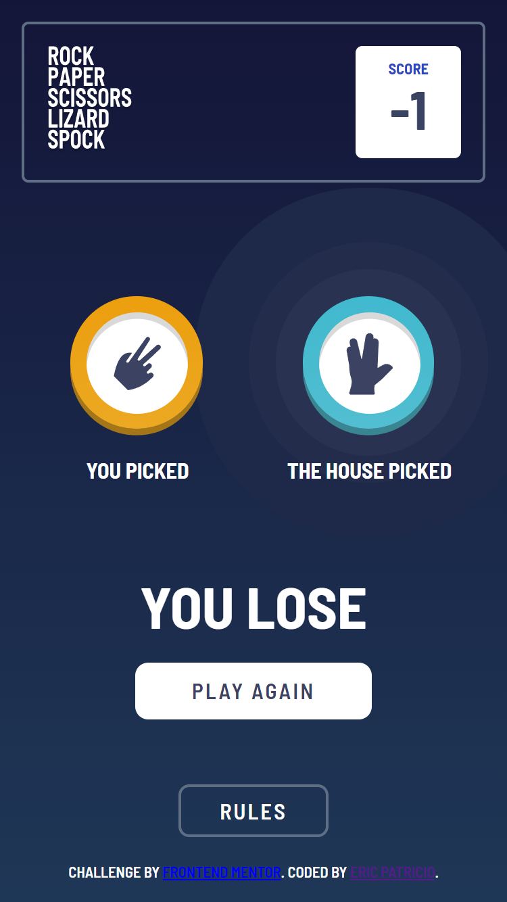
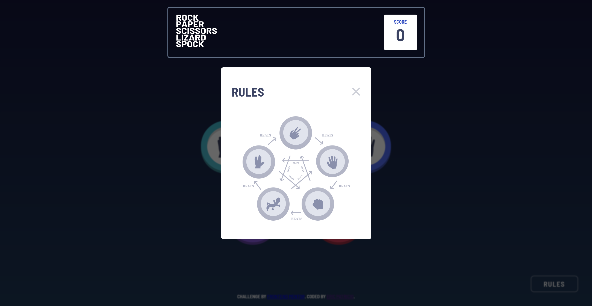
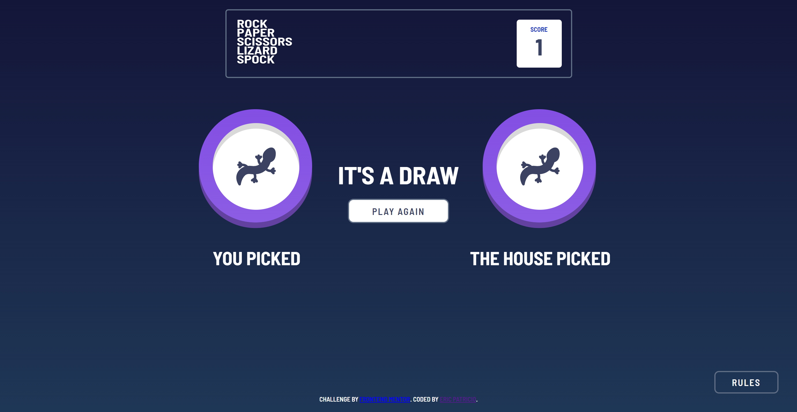

# Frontend Mentor - Rock, Paper, Scissors solution

This is a solution to the [Rock, Paper, Scissors challenge on Frontend Mentor](https://www.frontendmentor.io/challenges/rock-paper-scissors-game-pTgwgvgH).

### Screenshots

### Links

- Solution URL: [Frontend Mentor](https://www.frontendmentor.io/solutions/mobile-first-rock-paper-scissors-lizard-and-spock-game-w85iD_lmdw)
- Live Site URL: [Github page](http://ericpatricioportfolio.tech/rock-paper-scissors-lizard-spock_game/)

### Built with

- Semantic HTML5 markup
- CSS custom properties
- Flexbox
- CSS Grid
- Mobile-first workflow
- JavaScript dynamic functionality

## Author

- Website - [Eric Patricio](https://ericpatricioportfolio.tech/)
- GitHub - [ericpatricio](https://github.com/ericpatricio)
- Frontend Mentor - [@ericpatricio](https://www.frontendmentor.io/profile/ericpatricio)
- Twitter - [@EricPatricio](https://twitter.com/EricPatricio)
